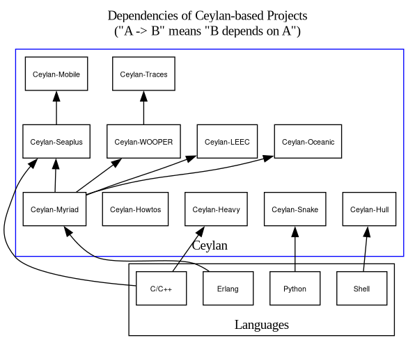

Ceylan
======

This project has for goal to provide, as free software, some high-level, portable, general-purpose developments.

This repository is just an umbrella, in the sense that it is mostly empty: its purpose is only to federate and give access to the `Ceylan-*` actual subprojects.

**Ceylan** currently comprises indeed 8 public subprojects:

 - [Ceylan-Heavy](https://github.com/Olivier-Boudeville/Ceylan-Heavy): for all general-purpose **C++** developments, to serve as a base for [OSDL](https://github.com/Olivier-Boudeville/OSDL)
 - [Ceylan-Hull](https://github.com/Olivier-Boudeville/Ceylan-Hull): a repository for all kinds of **shell scripts**
 - [Ceylan-Snake](https://github.com/Olivier-Boudeville/Ceylan-Snake): for some developments in **Python**
 - [Ceylan-Myriad](https://github.com/Olivier-Boudeville/Ceylan-Myriad): our toolbox for all our **Erlang-based** developments
 - [Ceylan-WOOPER](https://github.com/Olivier-Boudeville/Ceylan-WOOPER): for all developments dealing with **WOOPER** (OOP in Erlang)
 - [Ceylan-Traces](https://github.com/Olivier-Boudeville/Ceylan-Traces): for all **trace-related** developments (in Erlang again)
 - [Ceylan-Seaplus](https://github.com/Olivier-Boudeville/Ceylan-Seaplus): facilities to **better integrate C/C++ code to Erlang**
 - [Ceylan-Mobile](https://github.com/Olivier-Boudeville/Ceylan-Mobile): facilities to **control mobile phones and 3G keys from Erlang**

Additionally a collection of various technical recipes exists in [Ceylan-HOWTOs](https://github.com/Olivier-Boudeville/Ceylan-HOWTOs).
